ECOMMERCE PLATFORM DB DESIGN

There are total 4 tables:  
**1.Users:**  primary key : user\_id  
This table will contain information about different users and their role (buyer or seller).  
**2.Products**:primary key :product\_Id  
This table contains a list of all the products along with their seller, price, discount, rating.  
**3.Orders:** primary key : order\_id  
All the orders are stored here.  
**4.Reviews :** primary key: review\_id  
Here we will be storing reviews along with the text and star rating.

Foreign Keys:  
1\. In the products table we have **seller\_id** as foreign key which references **user\_id in users table.**  
2\. In the orders table we have **product\_id** and and **buyer\_id** as foreign which references **user\_id in users table** and **product\_id in products table.**  
3\. In the reviews table we have **product\_id** and and **buyer\_id** as foreign which references **user\_id in users table** and **product\_id in products table.**

ER DIAGRAM:  
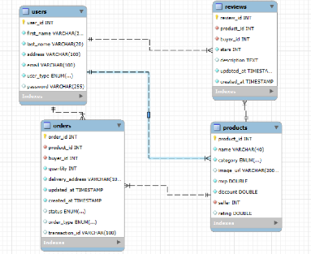

Created Tables: 
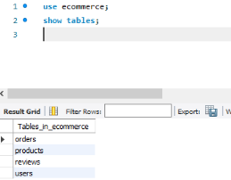 

**Querying and Crud operations:**  
Creating users: 

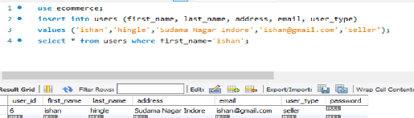

Query to get beauty items under 500:

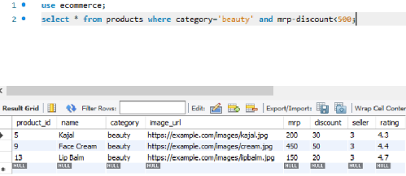  

Changing order status:  

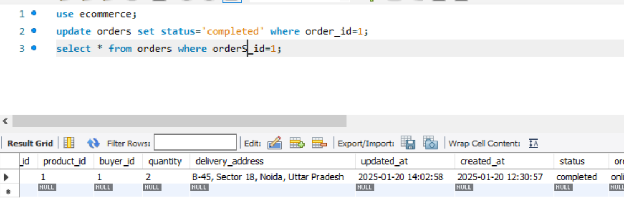

Deleting A product:

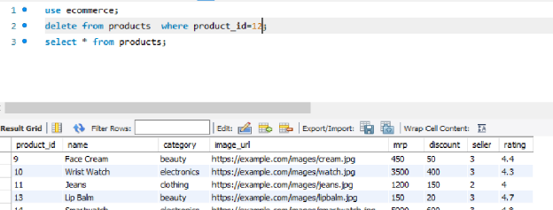

**Advanced Queries and Join**

Query to get product name and customer name from orders table   
Using joins:  

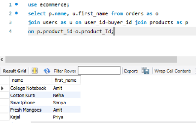

Get total revenue of products in the year 2024:

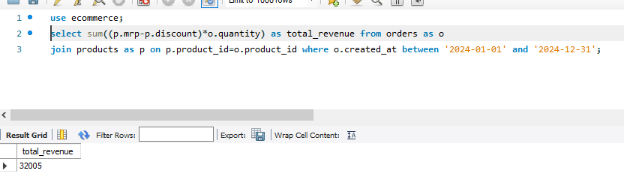

Getting Users with Multiple orders:

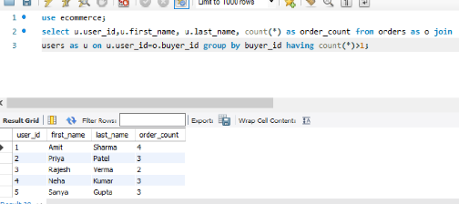

Indexing

* In users table both user\_id and email indexes are automatically created as they are unique, hence we don’t need to create new indexes here.  
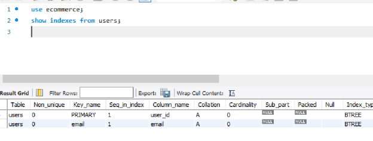
    
* In the products table we need to create an index on category, seller\_id. I am not indexing mrp and discount as they are updated frequently.  
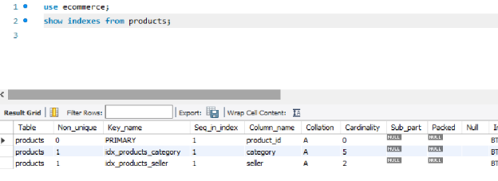

    
* In the orders table we can create index on buyer\_id, product\_id and status.  
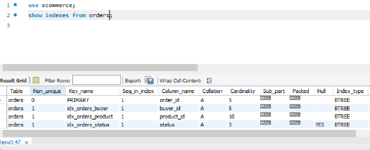
    
* In the reviews table Indexes are created on product\_id, and starts.  
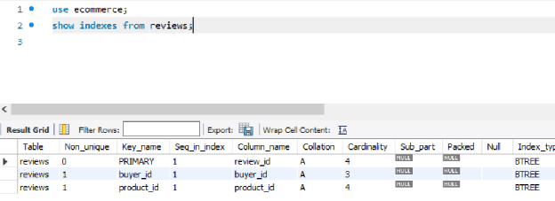
 